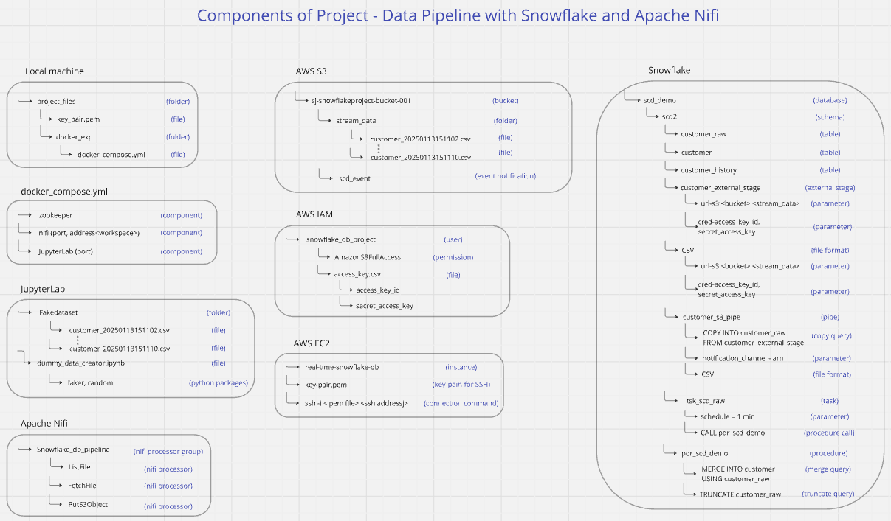

# Data_Pipeline_using_Apache_Nifi_and_Snowflake 
 
(Work in progress)

This project aims to implement a data pipeline which handles slowly changing dimensions of real time data.

### Data Pipeline Flowchart

 
### Project components diagram

 

### Highlights

* Implementation of SCD1 
* Snowflake Task

### AWS services used:
* EC2
* S3
* SQS 

### File Formats Handled:
* CSV

### Tools
* Snowflake
* Docker
* JupyterLab
* Apache Nifi
* VS code

### References
* https://datawithdarshil.com/
* https://aws.amazon.com/
* https://docs.snowflake.com/

